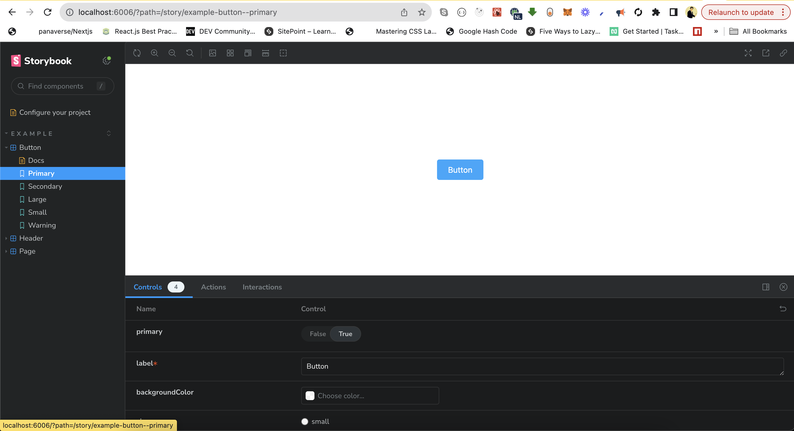

# Storybooks with NextJS and Tailwindcss

Following technologies were used in this boilerplate project:

### Storybooks

Storybook is a frontend workshop for building UI components and pages in isolation.

### NextJS

Next.js enables you to create full-stack Web applications by extending the latest React features, and integrating powerful Rust-based JavaScript tooling for the fastest builds.

### TailwindCss

A utility-first CSS framework packed with classes like flex, pt-4, text-center and rotate-90 that can be composed to build any design, directly in your markup.

## Installation with Next14

Run the following command:
`npx storybook@latest init`

It will create `.storybook` directory in the project.

Go to `.storybook > preview.ts` file and import globals.css that is containing tailwind configs, in our case its `import '../src/app/globals.css'`

Go to `tailwind.config.ts` and add the following in `config > content`
`'./src/stories/**/*.{js,ts,jsx,tsx,mdx}',`

In order to the run storybooks run the following command:
`npm run storybook`

